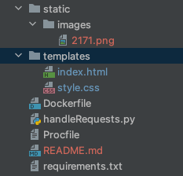
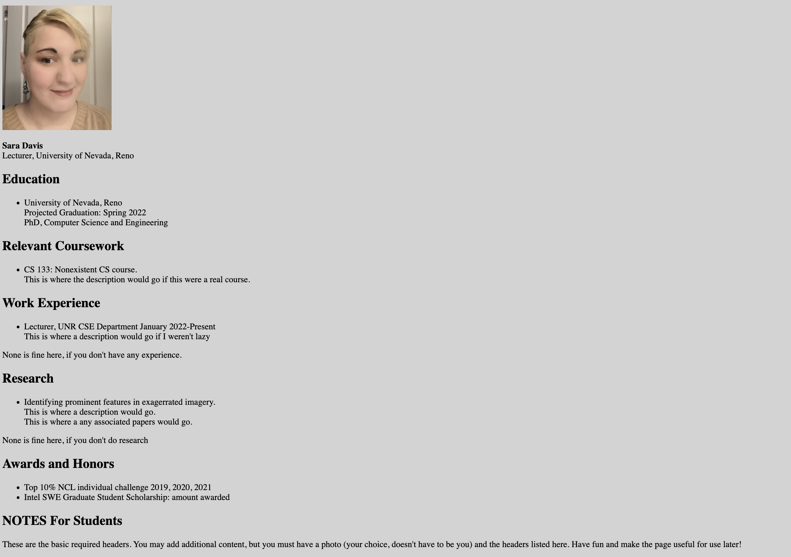

[](https://classroom.github.com/open-in-codespaces?assignment_repo_id=9432675)

**<p align = "center"> CS446-Fall22-PA4: Creating a webpage using Docker containers, Heroku PaaS, and Flask</p>**

**<p align = "center">Learning Outcomes</p>**
1. You will synthesize the underlying concepts of virtualization, cloud services, and networking/distributed systems on an OS.
2. You will gain practical experience creating a docker image to distribute a web page.
3. You will gain practical experience with HTML and Python (especially Flask).
4. You will gain practice reading library documentation and performing relevant internet searches for a technical problem.

**General Instructions and Hints**: 

-I do not care what you name your files (with the exception of your Dockerfile and requirements.txt), but at minimum you should have a directory called static and any images should be in there,
you should have a Dockerfile, a python script for the flask app, a requirements file, and a directory called templates to house your html file. 
You will also likely want a css file in the templates directory to make formatting easier. 
-The bare minimum requirements for your webpage are shown below.<br/> 
-When everything is done, open a terminal and cd to your github repo, wherever you saved it. Do the following: _git add ._ then _git commit -m <whatevermessageyouwant>_ then _git push_.<br/> Submit your repo link to webcampus AND the link of your webpage.
-If you have questions about implementation or a direction, please post it to slack! <br/>
-Unless told otherwise, commands should be entered on the command line (not in a web browser).
-I strongly urge you to use an IDE for this assignment. I use pycharm, which is a jetbrains product and is free with your [github student account](https://education.github.com/pack). You will need 
to use your github student account to use [Heroku](https://www.heroku.com/github-students) for free, so while you're there, you might as well grab an IDE. _Be sure to use your school email to register for the github student pack_
-Your code must run in Ubuntu 18.04, so I have supplied instructions for ubuntu. If you are using windows or mac to generate your Docker container, then you will need to do your own research. <br/>
-All work should be done on a machine where you have sudoer permission. Failure to do so will prevent you from installing necessary software. <br/>
-All work should be your own. <br/>


**<p align = "center"> Part 1, Creating A Flask App- Anaconda recommended </p>**
 **<p align = "center">Background</p>** <br/>

I strongly encourage you to use a clean anaconda environment with just Python:latest installed, and then conda install any necessary packages. 
Anaconda is an environment management system. It basically allows you to download installations from the internet, and segregate them from 
installations on your main machine. Each environment can be altered to have slightly different installs. Using anaconda 
makes figuring out which packages are necessary for your Docker container much easier, and also prevents any possible versioning issues. 
If you use Python a lot, it's a really useful tool. You can read about how to install it [here](https://docs.anaconda.com/anaconda/install/index.html),
and [here](https://docs.anaconda.com/navigator/tutorials/index.html) are some useful tutorials on how to work with anaconda environments; 
managing environments is probably the most relevant and useful page to you at the moment. If you are not interested in using anaconda, then you are welcome to do direct pip installs of each package needed.


Flask is a micro-web framework written in Python. It provides tools, libraries, and various implementations that allow programmers to build web applications. Before you get started,
you will need to pip install Flask. Directions on installing Flask can be found [here](https://flask.palletsprojects.com/en/2.2.x/installation/)


If you use anaconda, you should install Flask in a conda environment rather than using a pip install (which makes Flask available over the entire machine)
or a venv (which is relatively outdated).
 
**<p align = "center">General Directions</p>** <br/>
Create a python file for your Flask app. You can name it whatever you want, just make sure it has the .py extension. <br/>
Create an html file for your Flask app. You can name it whatever you want, just make sure it has the .html extension and that you have stored it in a directory called templates that is in the same directory as your python file.

You can see a photo of my directory setup for this assignment below: <br/>


You may use the following packages in this portion, though you may find that some of them are not necessary
 ```
Flask
os
subprocess
sys
numpy
```

_<yourFileName.py>_<br/>
This file will contain all of the code for your flask application. 

_<yourFileName.html>_<br/>
This file will contain all of the markup for your webpage.

_<yourFileName.css>_ (OPTIONAL)<br/>
This file is optional. CSS files contain code to format HTML. While HTML has formatting tags, they can be more difficult to use than CSS.

**<p align = "center">Assignment</p>**
In your python file, you will need to create your flask application. You can see a very, very basic example of a Flask app [here](https://flask.palletsprojects.com/en/2.2.x/quickstart/). After you import Flask and render_template from flask and import any other libraries, create a Flask app object outside of any functions in the global space. 
Create a main function that uses the OS package to get the integer port value of a port of your choice- do not use the first 1023 ports, you have a total of 65535 available to you. Instructions on how to create a python main function and call it are found [here](https://realpython.com/python-main-function/).
Instructions on how to get the operating system's os values using an os environ object can be found [here](https://www.geeksforgeeks.org/python-os-environ-object/). Use the object to access a PORT whichever you would like, and cast it to an int. You do not need to explicitly set the html methods (such as get, post etc) because Flask defaults to get only. 
Once you've gotten the port value use your global Flask app object to run in debug mode. Your host should be localhost, and your port should be the integer port value you just obtained.
Write another function (I called mine handleRequests) that returns a render template that has been given your html file path. This will allow Flask to render whatever markup you've added to the HTML file.
At the top of that function, you should have @app.route("/") just like in the demo flask application linked above. This tells the Flask that when it sees "/", this function should be run (so we don't need to make a call to it explicitly).


Your .html file should be saved in a templates directory. At bare minimum it should include a head with a title and metadata and a style that sets the background color. It should then have a body, where you write your code to create headers, paragraphs, lists, and to render your images on your page.
At a bare minimum, you need headers and information I have displayed in the image below. Your style does not need to match mine, and you can tinker with the appearance as much as you want. Just make sure you include all relevant headers and your image. <br/>
Here is a very basic html [template](https://ryanstutorials.net/html-tutorial/html-template.php), and here is a very nice website that discusses various HTML [tags](https://www.w3schools.com/html/default.asp). If you want to use a CSS file to style your page, make sure you include it as a stylesheet in the html head

If you write a css file, please make sure that the html file actually uses it. This site discusses [css](https://www.w3schools.com/css/) and how to implement it with html. It should be saved in the templates directory with the HTML file.

 <br/>


At this point, if you run your python script like normal ```python <yourfilename>.py``` your code should run, and you should be able to open a web browser (like firefox or chrome)
and type localhost:<selected port> into the address bar, so ```localhost:5``` if I had assigned the code to run on port 5 (which you absolutely should not do).
If you see everything from your HTML file rendered correctly, you're good to proceed to the next steps. Otherwise, tinker with the html until your happy with it. 
Everytime you want to see if your changes are what you want, you will have to run the python script again and refresh your localhost port page.
HTML (even with CSS) can be very finicky. Don't become frustrated! Look around the internet for resources that help you better understand how to format a webpage in HTML if the ones I supplied do not make sense to you!


**<p align = "center"> Part 2, Creating a requirements.txt file for your flask app</p>**
You will write a requirements.txt file to house all of the packages necessary to run your app. 

**<p align = "center">General Directions</p>** <br/>
You can use pip freeze and pipe it to a file with the following command, if you pip installed everything
```pip freeze > requirements.txt```

If you used anaconda to install everything, you can use ```conda list -e > requirements.txt```

A requirements.txt file is really useful! if you transfer it to another machine (or conda environment) you can use it to install the requirements at once from the file:
```pip install -r requirements.txt```. We're going to use this command later in our Dockerfile.


**<p align = "center"> Part 3, Setting up Docker, building an image, and running a container to serve your app</p>**
In this part, you will create a Dockerfile. It _must_ have the name Dockerfile or your docker commands will do nothing.
It should be saved in the same directory as your py file. You must install Docker before you move on to implementation.
[This](https://docs.docker.com/get-docker/) is a link to the Docker installation page. The left-hand toolbar has an abundance of Docker resources under get started.
You can also refer to the Docker command cheat sheet, or the dockerfilecommands file I've included in the repo. 

**<p align = "center">General Directions</p>** <br/>
Your docker file should do the following, in this order

1. pull the latest python image into your image
2. copy your requirements file from where-ever it's located to a directory called /app
3. pip install the requirements.txt file
4. specify a port to listen on- this should match the port you've set in your py file.
5. copy everything in the current directory to the app directory
6. configure the docker container to run as a python executable.
7. run your py file by providing the py file as the container's default.


You will need to decide which dockerfile commands to use to complete the Dockerfile, so feel free to research and use the resources I've provided.

Once the Dockerfile is complete, you can build the Docker image using ```docker image build -t <whatever tag you want> .```

Make sure you tag it with a name you remember using the -t flag. You can make sure it was successfully created by using ```docker images```


Next, run the tagged image in a container, and be sure to provide the port using ```docker run -p <port chosen>:<port chosen> -d <whatever tag you used on the image>```


**<p align = "center"> Part 4, Deploy the Flask App to Docker Hub</p>**
In this part, you will use Docker Hub to create a Docker repository. Docker Hub allows you to create and manage your docker containers with source control backended by Git.

You will need to go to docker hub and create a [free account](https://hub.docker.com/signup) before continuing.

**<p align = "center">General Directions</p>** <br/>
Once you have a docker hub account, login through your web browser. Select Repositories from the top menu bar, and create a new repository. You can name it whatever you want.


Next, you need to log into docker hub. Use ```docker login``` on the command line to log into Docker Hub on your local machine. I suggest you do it from the same directory as your code. 

When a docker image is pushed to Docker Hub, it has to follow a certain format. In this next step use the command ```docker tag <whatever tag you chose in part 3> <your docker hub username>/<whatever tag you chose in part 3>``` to create a Docker image on your local machine that uses the correct syntax to be able to push.

Finally, use the command ```docker push <docker hub username>/<whatever tag name you chose in part 3>``` to push your image to the hub.


At this point, if everything is successful, if you log into docker hub on your web browser, you should be able to see the repository in your repositories.

**<p align = "center"> Part 5, Deploy the containerized Flask App to Heroku</p>**
In this part, you will use your container from part 4 on the docker hub to create a webpage that is accessible outside of your local machine. 

You will need to go to Heroku and create an [account](https://hub.docker.com/signup) before continuing. Be sure to use your github student account so that it's free! If this is your first time requesting a student account, make sure you use your school email when you sign up.


**<p align = "center">General Directions</p>** <br/>
Once you have a heroku student account, you will need to log into heroku on the command line. Use ```heroku login``` and enter your information when prompted.

Next, create a Heroku app using ```heroku create <whatever app name you want>```

Then, add a file to your repository and name it Procfile- this name must be exact or you will not be able to run your page. Add ```web: gunicorn app:app``` to the Procfile. This will allow heroku to generate a flask web application using gunicorn as your web server in later steps.
After your Procfile is created and filled, you can push your docker container to heroku using ```heroku container:push web --app <whatever app name you created earlier>```
If you have authorization problems pushing, you may not be logged into docker hub on the command line. You will have to use this command ```docker login --username=_ --password=$(heroku auth:token) registry.heroku.com```

Finally, use ```heroku container:release web --app <whatever app name you chose>``` to release the container to heroku. 

If you open a browser on _any_ machine, you should be able to navigate to your webpage by going to ```https://<whatever you named the app>.herokuapp.com/```. It should look the same as when you navigated to localhost:<portnumber> earlier.


If everything looks good to you, that's the last step! Push to github, and submit your repo link and webpage link to webcampus!

 **To Submit**<br/>
 When you are done, you should use git to git push the following to your assignment repo (see instructions above):
 1) static/images/*<br/>
 2) templates/*<br/>
 3) Dockerfile<br/>
 4) .py file
 5) Procfile
 6) requirements.txt

You can submit as many times as you would like. *There is no autograder for this assignment, so use the web browser checks to ensure that you web page is up and running correctly.*

**If you do not submit your github repo link AND your heroku webpage link to webcampus, you will receive a 0! Please don't forget!**
